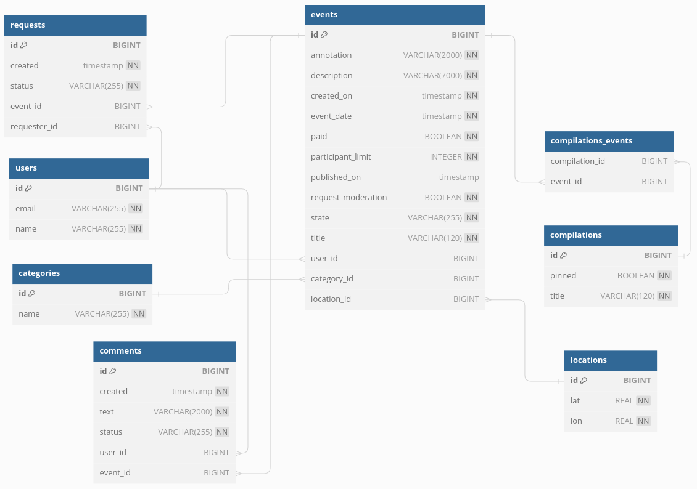

# java-explore-with-me

## Описание
Приложение — афиша. В этой афише можно предложить какое-либо событие от выставки до похода в кино и собрать компанию для участия в нём.
### Идея
Свободное время — ценный ресурс. Ежедневно мы планируем, как его потратить — куда и с кем сходить. Сложнее всего в таком планировании поиск информации и переговоры. Нужно учесть много деталей: какие намечаются мероприятия, свободны ли в этот момент друзья, как всех пригласить и где собраться.
### Два сервиса
* основной сервис будет содержать всё необходимое для работы продукта;
* сервис статистики будет хранить количество просмотров и позволит делать различные выборки для анализа работы приложения.

## Endpoints сервиса
- [API сервис статистики](./ewm-stats-service-spec.json)
- [API основной сервис](./ewm-main-service-spec.json)
- [API доп. функционала - комментарии](./ewm-main-comments.json)

## Модель схемы базы данных сервиса

### Ссылка на PR:
https://github.com/DmitriyKorokhov/java-explore-with-me/pull/5